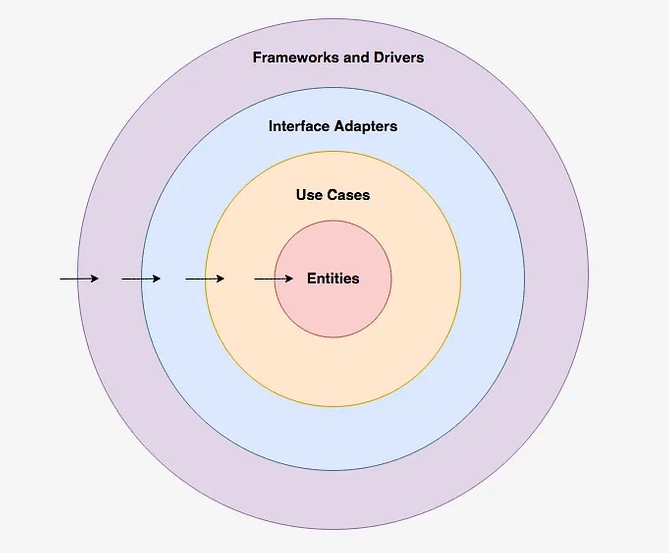

# Tech Challenge - FIAP - Fase II
Esse projeto é uma evolução do projeto criado na Fase I, utilizando agora as práticas de Clean Architecture aprendidas nas aulas.

Para uma revisão do projeto, contendo a documentação do Event Storm de onde o projeto se originou na Fase I, consultar o projeto no [Miro](https://miro.com/app/board/uXjVKC2h5jE=/).

## Autores
Turma: 7 SOAT.
- Jackson Pinheiro - [@pinheirojks](https://github.com/pinheirojks)
- Maurício Murakami - [@maurimurakami](https://github.com/maurimurakami)
- Vinícius Piovezan - [@Piovezan1207](https://github.com/Piovezan1207)

# Tecnologias utilizadas
* A aplicação foi desenvolvida utilizando Java 17, framework Spring Boot, com a utilização do banco de dados MySql. Além disso foi utilizado o Docker para a execução da aplicação localmente, contendo uma instância do banco de dados, além do Swagger para a documentação da API.

# Arquietura Limpa (Clean Architecture)


# Estrutura do projeto

```
├───adapter
│   ├───controller
│   ├───gateway
│   └───presenter
├───config
├───core
│   ├───entity
│   ├───repository
│   ├───type
│   └───usecase
└───external
    ├───handler
    │   ├───dto
    │   ├───exception
    │   └───service
    └───infra
        ├───exception
        └───persistence
            ├───entity
            └───repository
```
O projeto está organizado na estrutura acima, respeitando as camadas definidas na arquitetura limpa, conforme observa-se na imagem acima.  

#### Frameworks e Drivers
No pacote `external` estão todos os objetos pertencentes à camada mais externa da Clean Architecture, `Frameworks and Drivers`. Para uma melhor organização existem sub-diretórios (pacotes filhos) na mesma, conforme abaixo:
* `handler`: Diretamente no pacote 'handler' estão os RestControllers, responsáveis por manipular as requisições HTTP realizadas à API. Nomeou-se com o sufixo "Handler" para não serem confundidos com os controllers das entidades vistos em breve logo abaixo.
* `handler.dto`: O pacote 'dto' presente em 'handler' contempla todos os DTOs utilizados pela aplicação para o tráfego de dados entre camadas e também de retorno às requisições HTTP. 
* `handler.exception`: Nesse pacote estão presentes handlers para captura e tratamento de exceções que possam ocorrer em tempo de execução do projeto. No escopo desse projeto apenas uma classe foi criada e disponibilizada nesse pacote, uma vez que trata todos os erros passíveis de ocorrer, retornando assim uma resposta HTTP adequada.
* `handler.service`: Por utilizarmos o framework Spring para facilitar algumas tarefas, optou-se por criar uma cama extra, ainda em 'external' contendo serviços anotados com a anotação `@Service` do Spring, sendo reponsáveis pelo controle de transações e também injeção de dependências necessárias às camadas internas do projeto.
* `infra`: Ao mesmo nível de do pacote 'handler' temos o pacote 'infra', o qual contêm outros pacotes necessários para a infraestrutura do projeto. Não há classes diretamente nesse pacote, apenas seus sub-diretórios conforme visto na hierarquia acima e explicados a seguir:
* `infra.exception`: Nesse pacote estão localizadas exceções passíveis de ocorrer no projeto, às quais são capturadas pela classe presente no pacote acima citado 'handler.exception'. Exemplos: 'DomainUseCaseException' é lançada quando um UseCase (regra de negócio) é violado, já 'NotFoundEntityException' ocorre quando uma entidade necessária para a correta execução da regra de negócio não foi localizada com o ID informado.
* `infra.persistence`: Aqui encontram-se os objetos necessários à manipulação de dados no repositório de dados a ser utilizado. Para o escopo desse projeto utilizou-se como repositório de dados um banco de dados MySQL. Fazendo uso de JPA, que é a API Java para persistência, separou-se os objetos em dois sub pacotes: 'entity', contendo as entidades do modelo, anotadas com @Entity afim de serem reconhecidas pelo JPA, além da 'repository', as quais contêm as implementações dos repositórios para cada entidade do negócio. Por exemplo, para a entidade 'Categoria', vista mais adiante, têm-se a classe 'CategoriaDatabaseDataRepository', reponsável por interagir com o banco de dados quando se tratando da entidade Categoria. Explicados com mais detalhes a seguir, o sufixo 'Database' indica que a base de dados que esse repositório interage é um banco de dados, enquanto 'DataRepository' indica que essa classe é um tipo de repositório de dados.
* `config`: Fora do pacote 'external', mas ainda pertencendo a camada mais externa da Clean Architecture está esse pacote contendo configurações necessárias para o correto funcionamento do projeto. Um exemplo é a classe `OpenApiConfig`, responsável por gerar a documentação da API com Swagger. Também estão presentes as interfaces `FileSystemConfig` e `DatabaseConfig`, as quais definem um "contrato" para acesso à repositórios de dados em arquivos e bancos de dados respectivamente. No escopo do projeto, apenas a interface `DatabaseConfig` foi utilizada, tendo a outra sido criada apenas ilustrativamente, afim de demonstrar que o projeto está independente de base de dados. Voltando às conexões a bancos de dados, duas classes implementam `DatabaseConfig`, sendo elas `MySQLDatabaseConfig` e `PostgresDatabaseConfig`. Por momento apenas a classe referente ao MySQL foi implementada, uma vez que a base de dados escolhida foi essa, porém também ilustrativamente foi criada a classe para o Postgres com o objetivo de demonstrar que a API é transparente também quanto à banco de dados. Urtilizando-se de recursos do Spring, a classe `MySqlDatabaseConfig` foi anotada com @Profile("mysql"), definindo assim um perfil ativo na aplicação. Para conectar em uma base postgres, bastaria implementar a classe `PostgresDatabaseConfig` já anotada com o perfil para tal banco e alterar o perfil ativo em application.properties.

#### Interface Adapters
O pacote `adapter` contempla os objetos referentes à camada `Interface adapters` da arquitetura, possuindo 3 sub-pacotes: `controller`, `gateway` e `presenter`, representando respectivamente os controllers, gateways e presenters das entidades de domínio da aplicação.

#### Use Cases
O pacote `core` contempla das duas camadas mais internas da arquitetura. Inicialmente falando sobre os useCases, os mesmos estão dispostos no pacote `core.usecase`. Também nesse pacote `core` há o sub pacote `repository` que contém as interfaces dos repositórios de dados, ou seja, as abstrações com as quais os use cases necessitam interagir, via gateway, para consulta e persistência de dados, independente de qual for a fonte dos mesmos.

#### Entities
Os pacotes `core.entity` e `core.type` representam os objetos presentes na camada `Entities` da Clean Architecrute. O primeiro contempla das entidades propriamente ditas, enquanto o segundo foi criado para fins de organização, contemplando uma extensão às entidades. Ali estão presentes classes do tipo `Enum`, um tipo presente na linguagem Java para representar um conjunto limitado de dados. Devido às entidades possuirem atributos nos quais suas opções de valores são limitadas, optou-se pela criação dessas Enums.


# Premissas para a execução do projeto localmente.
* Ter o [docker](https://www.docker.com/products/docker-desktop/) instalado na máquina.
* Realizar o checkout da branch `Main` deste repositório.

# Passo a passo para a execução do projeto localmente.
No vídeo apresentado demonstramos a execução do projeto na infraestrutura do Kubernetes, porém caso seja necessário executar o projeto localmente, seguir os passos a seguir:
* Após o checkout da branch Main, acessar a raiz do projeto onde se encontra o arquivo docker-compose.yml.
* Com o terminal aberto na raiz do projeto, executar o comando `docker-compose up` para iniciar a aplicação.
* Após a execução do comando, a aplicação responderá em [localhost:8080](localhost:8080).
* A aplicação estará disponível para testes na interface do Swagger, acessível em [localhost:8080/swagger-ui.html](localhost:8080/swagger-ui/index.html).
* Após a execução do comando `docker-compose up`, aguardar alguns instantes até que a aplicação esteja disponível.
* Para encerrar a execução da aplicação, basta executar o comando `docker-compose down`.

# Funcionalidades
* A seguir são apresentadas as funcionalidades presentes na API.

### Categorias
- Listagem de todas as categorias disponíveis.

### Clientes
- Cadastro de clientes
- Consulta do cliente via CPF

### Produtos
- Criar, editar e remover produtos (soft delete, onde o mesmo é desativado).
- Buscar produtos por categoria, trazendo apenas os ativos.
- Buscar todos os produtos ativos.
- Consulta de produto por ID, trazendo o registro independente de status.

### Pedidos
- Checkout do pedido, onde o mesmo é criado com o status RECEBIDO, estando assim aguardando pagamento para prosseguir às próximas etapas.
- Listar todos os pedidos, independente de status, ordenados por situação e data/hora.
- Listar todos os pedidos da fila, que contemplam as situações: RECEBIDO, EM_PREPARACAO, PRONTO e FINALIZADO.
- Consultar status de pagamento do pedido.
- Consultar detalhes do pedido por ID.
- Atualizar status do pedido.
- Atualizar status de pagamento do pedido.

### Webhook pagamentos
- Permite receber o retorno de um gateway de pagamentos para atualizar o status de pagamento do pedido. Por momento está mockado, não foi feito de fato uma integração. Para variação de cenários, aleatoriamente o Mock define se o pagamento foi aprovado ou não.

# Observações
* Na URL da documentação da API citada anteriormente, deve-se seguir alguns passos para efetuar os requests. Será ilustrado aqui um endpoint para listagem de categorias, mas o processo é o mesmo para todos os demais: Para visualizar as categorias disponíveis, navegar até o grupo "Categorias", expandir o endpoint "GET" e clicar em "Try it out", o que habilitará o botão "Execute" para efetuar o request. Após a execução, a lista de categorias com seus respectivos IDs serão listadas na área logo abaixo ao botão "Execute".
* No CRUD de produtos, o método DELETE efetua um "soft delete", atualizando a flag "ativo" para false. Ao listar os produtos, aqueles com status "ativo = false" não serão retornados. Porém na consulta de produto por ID, mesmo que esse esteja desativado, o mesmo é retornado para fins de consulta. A listagem de categorias também só lista os produtos ativos. Somente é possível efetuar pedidos para produtos ativos.
* Sobre o gateway de pagamentos, não foi realizada a integração com o MercadoPago, sendo o mesmo Mockado para fins de execução do correto fluxo das APIs. A aplicação também está transparente quanto à integrações com meios de pagamentos. A classe abstrata `AbstractPagamentoGateway`, presente no pacote `core.entity` é uma classe abstrata que define o contrato da integração com meios de pagamento. Extendendo essa classe foram criadas, nesse mesmo pacote, as classes concretas `MockPagamentoGateway` e `MercadoPagoPagamentoGateway`. Sendo a última apenas para ilustrar a transparência da integração, a classe mockada gera um status de pagamento aleatório, por vezes sendo 'APROVADO' e por vezes sendo 'RECUSADO', para fins de validação dos fluxos. O Webhook responsável por receber a integração do gateway de pagamentos está disponível na documentação e responde na URL '/lanchonete/v1/payment/webhook/{gateway}/{idPedido}', sendo o parâmetro {gateway} o que determina qual gateway está chamando a API. Para utilizar o 'MockPagamento', enviar a constante 'MOCK' nesse parâmetro, já para simular o Mercado Pago deveria-se utilizar a constante 'MERCADOPAGO'. Essa última por sua vez gerará uma exceção da aplicação, informando que tal integração não foi implementada.
